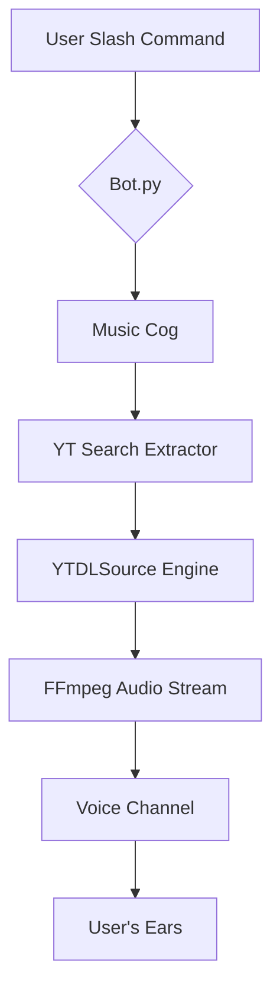

# 🎵 Ultimate Modern Discord Music Bot

[](https://www.python.org/downloads/)
[](https://discordpy.readthedocs.io/en/stable/)
[](https://opensource.org/licenses/MIT)

Sebuah mahakarya bot musik Discord yang dibangun menggunakan **Python murni**, mengedepankan performa tinggi, desain UI yang elegan, dan kemudahan penggunaan melalui fitur **Slash Commands** terbaru. Bot ini dirancang khusus untuk memberikan pengalaman mendengarkan musik yang mulus tanpa hambatan.

- **🚀 Performa Kilat**: Optimalisasi `yt-dlp` tingkat tinggi untuk ekstraksi metadata yang instan.
- **💎 UI Premium**: Pesan "Now Playing" dilengkapi dengan **Interactive Buttons** (Play, Pause, Skip, Stop, Loop).
- **🔒 Keamanan Terjamin**: Menggunakan `.env` untuk melindungi Token Bot Anda.
- **⚡ Slash Commands Only**: Mengikuti standar terbaru Discord, tidak ada lagi prefix `!` atau `?` yang membosankan.
- **🎧 Audio Tanpa Buffer**: Konfigurasi FFmpeg khusus untuk streaming langsung tanpa download file.

---

## 📌 Daftar Isi
1. [Fitur Utama](#-fitur-fitur-unggulan)
2. [Daftar Perintah (Slash Commands)](#-daftar-perintah-slash-commands)
3. [Panduan Instalasi & Persiapan](#-panduan-instalasi--persiapan)
4. [Detail Konfigurasi (.env)](#-detail-konfigurasi-env)
5. [Struktur Folder Proyek](#-struktur-folder-proyek)
6. [Arsitektur Sistem](#-arsitektur-sistem)
7. [Filosofi Kode](#-filosofi-kode-code-philosophy)
8. [Referensi API Internal](#-referensi-api-internal-internal-api)
9. [Deep Dive: Troubleshooting](#-deep-dive-panduan-lanjutan--troubleshooting)
10. [Tips Hosting 24/7](#2-tips-hosting-247)
11. [Panduan Pengembangan (Developer Guide)](#-panduan-pengembangan-developer-guide)
12. [Roadmap & Changelog](#-roadmap-pengembangan-masa-depan)
13. [F.A.Q](#3-masalah-umum-faq)
14. [Penafian Hukum & Branding](#-penafian-hukum-legal-disclaimer)

---

## 🛠️ Fitur-Fitur Unggulan

### 1. Sistem Antrean (Queue System) Canggih
Mendukung penambahan lagu tanpa batas, pengacakan antrean (`/shuffle`), dan penghapusan lagu spesifik (`/remove`).

### 2. Mode Loop Multi-Fungsi
- **Single Loop**: Mengulang satu lagu yang sama terus menerus.
- **Queue Loop**: Mengulang seluruh daftar putar secara berputar.

### 3. Kontrol Interaktif
Kontrol musik langsung melalui tombol di bawah pesan tanpa perlu mengetik perintah berulang kali.

### 4. Smart Voice Management
- **Auto-Join**: Bergabung otomatis saat Anda memutar lagu.
- **Self-Deafen**: Menghemat bandwidth dan performa dengan mode tuli otomatis.
- **Auto-Disconnect**: Keluar otomatis jika tidak ada aktivitas untuk menghemat resource server.

---

## 🎮 Daftar Perintah (Slash Commands)

| Perintah | Deskripsi | Parameter |
| :--- | :--- | :--- |
| `/help` | Menampilkan menu bantuan premium ini. | - |
| `/play` | Memutar lagu dari YouTube (URL atau Judul). | `query` |
| `/nowplaying` | Menampilkan detail lagu yang sedang diputar. | - |
| `/queue` | Melihat daftar 10 lagu mendatang di antrean. | - |
| `/skip` | Melewati lagu saat ini ke lagu berikutnya. | - |
| `/pause` | Menjeda pemutaran musik sementara. | - |
| `/resume` | Melanjutkan musik yang dijeda. | - |
| `/stop` | Menghentikan musik dan menghapus antrean. | - |
| `/shuffle` | Mengacak seluruh daftar lagu di antrean. | - |
| `/remove` | Menghapus lagu tertentu dari antrean. | `index` |
| `/volume` | Mengatur volume suara bot (1-100%). | `volume` |
| `/join` | Memanggil bot masuk ke Voice Channel Anda. | - |
| `/leave` | Mengeluarkan bot dari Voice Channel. | - |

---

## 🚀 Panduan Instalasi & Persiapan

### 1. Prasyarat Sistem
- **Python 3.10+**: [Unduh di sini](https://www.python.org/).
- **FFmpeg**: Wajib terinstal di sistem Anda.

### 2. Kloning & Instalasi Library
```bash
pip install -r requirements.txt
```

### 3. Menjalankan Bot
```bash
python bot.py
```

---

## ⚙️ Detail Konfigurasi (.env)

| Variabel | Fungsi | Contoh Nilai |
| :--- | :--- | :--- |
| `DISCORD_TOKEN` | Token utama bot dari Discord Portal. | `MTUwMTI2...` |
| `DEBUG_MODE` | Aktifkan log detail di terminal (`True`/`False`). | `False` |
| `GUILD_ID` | ID Server untuk sinkronisasi instan (Dev Mode). | `1215693090...` |
| `LOG_MAX_BYTES` | Ukuran maksimal file log sebelum di-rotate. | `5242880` (5MB) |
| `LOG_BACKUP_COUNT` | Jumlah file backup log yang disimpan. | `5` |

---

## 📦 Struktur Folder Proyek

```text
MusicBot/
├── cogs/
│   └── music.py        # Inti dari semua perintah Slash & logika Musik
├── modules/
│   ├── player.py       # Mesin utama (MusicPlayer & YTDLSource)
│   └── ui.py           # Desain tombol interaktif (Buttons & Views)
├── utils/
│   └── logger.py       # Sistem log profesional (Console & File)
├── logs/
│   └── bot.log         # Rekam jejak aktivitas bot
├── .env                # Konfigurasi rahasia
├── bot.py              # Entry point utama aplikasi
├── requirements.txt    # Daftar dependensi library
└── README.md           # Dokumentasi
```

---

## 🏗️ Arsitektur Sistem



---

## 🧩 Filosofi Kode (Code Philosophy)

Proyek ini dibangun dengan prinsip-prinsip pengembangan perangkat lunak modern:
- **Modularitas**: Fungsi dipisahkan ke modul spesifik (`cogs`, `modules`, `utils`).
- **Asynchronicity**: Menggunakan `asyncio` secara menyeluruh.
- **Readability**: Kode bersih gaya PEP 8 dengan komentar mendalam.

---

## 📖 Referensi API Internal (Internal API)

### Class: `MusicPlayer`
- `queue`: `asyncio.Queue` - Antrean lagu.
- `current`: `Song` - Lagu aktif.
- `player_loop()`: Loop utama pemroses antrean.

### Class: `YTDLSource`
- `from_url(url, stream=True)`: Method asinkron ekstraksi audio.
- `cleanup()`: Pembersihan resource setelah pemutaran.

---

## 🛠️ Deep Dive: Panduan Lanjutan & Troubleshooting

### 1. Mengatasi Masalah Video Age-Restricted
Gunakan file `cookies.txt`:
1. Unduh dengan ekstensi browser "Get cookies.txt LOCALLY".
2. Simpan di root folder bot.
3. Tambahkan `'cookiefile': 'cookies.txt'` pada `ytdl_format_options` di `modules/player.py`.

### 2. Tips Hosting 24/7
- **VPS**: Gunakan Ubuntu 22.04 LTS.
- **PM2**: `pm2 start bot.py --name "music-bot" --interpreter python3`.

---

## 🛠️ Panduan Pengembangan (Developer Guide)

### Menambahkan Command Baru
```python
@app_commands.command(name="nama", description="deskripsi")
@app_commands.guild_only()
async def nama(self, interaction: discord.Interaction):
    await interaction.response.defer()
    # Logika
    await interaction.followup.send("Berhasil!")
```

### Optimasi FFmpeg
- `before_options`: Menangani rekoneksi otomatis.
- `options`: Filter `-vn` untuk hemat resource.

---

## 📈 Roadmap & Changelog

### 📈 Roadmap Pengembangan
- [ ] Integrasi Lirik Lagu real-time.
- [ ] Dukungan SoundCloud & Mixer.
- [ ] Sistem Leveling Musik (XP).

### 📈 Changelog
- **v1.4.0**: Optimalisasi stabilitas & Error handling global.
- **v1.3.0**: Penambahan `/shuffle`, `/remove`, dan `/help`.
- **v1.2.0**: Slash Commands & UI Buttons.

---

## 3. Masalah Umum (F.A.Q)
- **Q: Kenapa lagu tiba-tiba berhenti?** - Cek stabilitas internet server.
- **Q: Kenapa bot tidak merespon?** - Pastikan sinkronisasi Slash Command selesai.
- **Q: Suara bot lag?** - Cek beban CPU atau ganti region Voice Channel.

---

## 🤝 Kontribusi & Donasi
Kami menerima kontribusi melalui *Pull Request*. Berikan **Star ⭐** jika bermanfaat!

---

## ⚖️ Penafian Hukum & Branding

### ⚖️ Penafian Hukum (Legal Disclaimer)
Bot ini untuk edukasi & penggunaan pribadi. Patuhi **ToS YouTube**. Kami tidak bertanggung jawab atas penyalahgunaan hak cipta.

### 🌈 Skema Warna UI
Menggunakan warna **Blurple (`#5865F2`)** agar senada dengan branding asli Discord.

---

> [!IMPORTANT]
> Jaga kerahasiaan `DISCORD_TOKEN`. Jangan unggah file `.env` ke repositori publik.

**© 2026 Antigravity - Dokumentasi v1.5.0-Final.**
