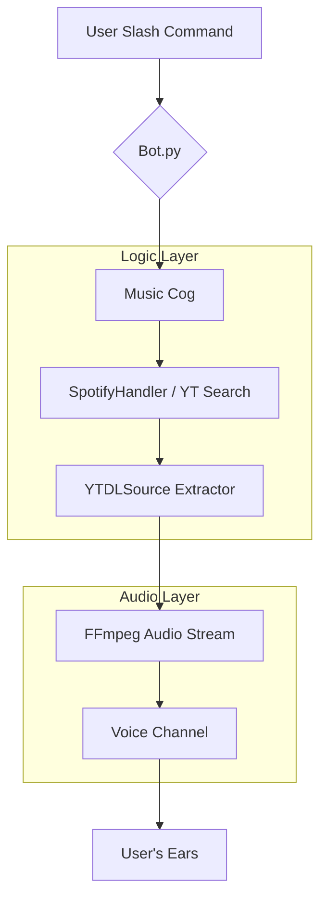

# 🎵 Ultimate Modern Discord Music Bot

[](https://www.python.org/downloads/)
[](https://discordpy.readthedocs.io/en/stable/)
[](https://opensource.org/licenses/MIT)

Sebuah mahakarya bot musik Discord yang dibangun menggunakan **Python murni**, mengedepankan performa tinggi, desain UI yang elegan, dan kemudahan penggunaan melalui fitur **Slash Commands** terbaru. Bot ini dirancang khusus untuk memberikan pengalaman mendengarkan musik yang mulus tanpa hambatan.

---

## ✨ Kenapa Memilih Bot Ini?

Bot ini bukan sekadar pemutar musik biasa. Kami mengintegrasikan teknologi ekstraksi audio tercanggih untuk memastikan stabilitas dan kualitas suara maksimal.

- **🚀 Performa Kilat**: Optimalisasi `yt-dlp` tingkat tinggi untuk ekstraksi metadata yang instan.
- **💎 UI Premium**: Pesan "Now Playing" dilengkapi dengan **Interactive Buttons** (Play, Pause, Skip, Stop, Loop).
- **🔒 Keamanan Terjamin**: Menggunakan `.env` untuk melindungi Token Bot Anda.
- **⚡ Slash Commands Only**: Mengikuti standar terbaru Discord, tidak ada lagi prefix `!` atau `?` yang membosankan.
- **🎧 Audio Tanpa Buffer**: Konfigurasi FFmpeg khusus untuk streaming langsung tanpa download file.

---

## 🛠️ Fitur-Fitur Unggulan

### 1. Sistem Antrean (Queue System) Canggih
Mendukung penambahan lagu tanpa batas, pengacakan antrean (`/shuffle`), dan penghapusan lagu spesifik (`/remove`).

### 2. Mode Loop Multi-Fungsi
- **Single Loop**: Mengulang satu lagu yang sama terus menerus.
- **Queue Loop**: Mengulang seluruh daftar putar secara berputar.

### 3. Kontrol Interaktif
Kontrol musik langsung melalui tombol di bawah pesan tanpa perlu mengetik perintah berulang kali.

### 4. Smart Voice Management
- **Auto-Join**: Bergabung otomatis saat Anda memutar lagu.
- **Self-Deafen**: Menghemat bandwidth dan performa dengan mode tuli otomatis.
- **Auto-Disconnect**: Keluar otomatis jika tidak ada aktivitas untuk menghemat resource server.

---

## 🎮 Daftar Perintah (Slash Commands)

Semua perintah di bawah ini menggunakan sistem **Slash Commands (/)**.

| Perintah | Deskripsi | Parameter |
| :--- | :--- | :--- |
| `/help` | Menampilkan menu bantuan premium ini. | - |
| `/play` | Memutar lagu dari YouTube (URL atau Judul). | `query` (Wajib) |
| `/nowplaying` | Menampilkan detail lagu yang sedang diputar. | - |
| `/queue` | Melihat daftar 10 lagu mendatang di antrean. | - |
| `/skip` | Melewati lagu saat ini ke lagu berikutnya. | - |
| `/pause` | Menjeda pemutaran musik sementara. | - |
| `/resume` | Melanjutkan musik yang dijeda. | - |
| `/stop` | Menghentikan musik dan menghapus antrean. | - |
| `/shuffle` | Mengacak seluruh daftar lagu di antrean. | - |
| `/remove` | Menghapus lagu tertentu dari antrean. | `index` (Wajib) |
| `/volume` | Mengatur volume suara bot (1-100%). | `volume` (Wajib) |
| `/join` | Memanggil bot masuk ke Voice Channel Anda. | - |
| `/leave` | Mengeluarkan bot dari Voice Channel. | - |

---

## 📦 Struktur Folder Proyek

```text
MusicBot/
├── cogs/
│   └── music.py        # Inti dari semua perintah Slash & logika Musik
├── modules/
│   ├── player.py       # Mesin utama (MusicPlayer & YTDLSource)
│   └── ui.py           # Desain tombol interaktif (Buttons & Views)
├── utils/
│   └── logger.py       # Sistem log profesional (Console & File)
├── logs/
│   └── bot.log         # Rekam jejak aktivitas bot
├── .env                # Konfigurasi rahasia (Token, Guild ID)
├── bot.py              # Entry point utama aplikasi
├── requirements.txt    # Daftar dependensi library
└── README.md           # Dokumentasi super lengkap
```

---

## 🚀 Panduan Instalasi & Persiapan

### 1. Prasyarat Sistem
- **Python 3.10+**: [Unduh di sini](https://www.python.org/).
- **FFmpeg**: Wajib terinstal di sistem Anda.
  - Windows: Tambahkan ke `System PATH`.
  - Linux: `sudo apt install ffmpeg`.

### 2. Kloning & Instalasi Library
```bash
# Instal library yang dibutuhkan
pip install -r requirements.txt
```

### 3. Konfigurasi `.env`
Buka file `.env` dan lengkapi datanya:
```env
DISCORD_TOKEN=Token_Bot_Anda
DEBUG_MODE=False
GUILD_ID=ID_Server_Anda (Opsional, untuk sinkronisasi instan)
```

### 4. Menjalankan Bot
```bash
python bot.py
```

---

## 🛡️ Penanganan Error (Error Handling)
Bot ini dilengkapi dengan **Global Error Handler** yang akan menangkap masalah seperti:
- Pengguna tidak berada di Voice Channel.
- Bot kekurangan izin (Permission) untuk berbicara/bergabung.
- Lagu tidak ditemukan di YouTube.
- Masalah jaringan atau rate limit API.

---

## 📝 Catatan Teknis
- **FFmpeg Options**: Menggunakan flag `-reconnect` untuk mencegah pemutusan audio di tengah jalan.
- **YTDL Options**: Dioptimalkan dengan `force_ipv4` dan `cachedir: False` untuk kecepatan ekstraksi maksimal.
- **Asyncio Queue**: Menggunakan antrean asinkron murni agar tidak menghambat kinerja bot utama.

---

## 🤝 Kontribusi
Ingin menambahkan fitur? Silakan lakukan *fork* dan kirimkan *pull request* Anda! Kami sangat menghargai kontribusi untuk membuat bot ini menjadi lebih baik lagi.

**Dibuat dengan ❤️ oleh Antigravity.**

---

## 🛠️ Deep Dive: Panduan Lanjutan & Troubleshooting

### 1. Mengatasi Masalah Video Age-Restricted
Terkadang YouTube memblokir akses ke video tertentu (age-restricted). Untuk mengatasinya, Anda bisa menggunakan file `cookies.txt`:
1. Instal ekstensi **"Get cookies.txt LOCALLY"** di Chrome/Edge.
2. Buka YouTube, klik ekstensi tersebut, dan unduh filenya.
3. Simpan sebagai `cookies.txt` di folder root bot.
4. Perbarui baris `ytdl_format_options` di `modules/player.py` dengan menambahkan `'cookiefile': 'cookies.txt'`.

### 2. Tips Hosting 24/7
Agar bot musik Anda tetap menyala tanpa henti, kami menyarankan beberapa opsi berikut:
- **VPS (Virtual Private Server)**: Gunakan Ubuntu 22.04 LTS. Instal `screen` atau `pm2` untuk menjalankan bot di background.
  ```bash
  # Menjalankan dengan PM2 (Memerlukan Node.js)
  pm2 start bot.py --name "music-bot" --interpreter python3
  ```
- **Docker**: (Segera Hadir) Kami sedang menyiapkan `Dockerfile` untuk deployment satu klik.

### 3. Masalah Umum (F.A.Q)
- **Q: Kenapa lagu tiba-tiba berhenti?**
  - **A**: Pastikan koneksi internet server Anda stabil. Bot sudah menggunakan flag `-reconnect`, namun pemutusan jaringan yang lama tetap akan menghentikan audio.
- **Q: Kenapa bot tidak merespon perintah slash?**
  - **A**: Pastikan Anda sudah mengisi `GUILD_ID` di `.env` untuk sinkronisasi instan, atau tunggu hingga 1 jam untuk sinkronisasi global.
- **Q: Suara bot pecah atau lag?**
  - **A**: Ini biasanya masalah CPU pada server atau lokasi server yang terlalu jauh dari region Voice Channel Discord. Pastikan region Voice Channel sama dengan lokasi VPS Anda.

---

## 📈 Roadmap Pengembangan Masa Depan
- [ ] Integrasi Lirik Lagu secara real-time.
- [ ] Dukungan pemutaran dari SoundCloud dan Mixer.
- [ ] Sistem Leveling Musik (XP setiap kali mendengarkan).
- [ ] Web Dashboard sederhana untuk kontrol antrean (Opsional).

---

## 📝 Lisensi & Hak Cipta
Proyek ini dilisensikan di bawah **MIT License**. Anda bebas menggunakan, memodifikasi, dan mendistribusikan ulang kode ini selama menyertakan atribusi asli.

---

> [!IMPORTANT]
> Selalu jaga kerahasiaan `DISCORD_TOKEN` Anda. Jangan pernah membagikan file `.env` kepada siapapun atau mengunggahnya ke repositori publik tanpa `.gitignore`.

---

## 🏗️ Arsitektur Sistem

Berikut adalah alur kerja bot dalam memproses permintaan musik Anda:



---

## ⚙️ Detail Konfigurasi (.env)

| Variabel | Fungsi | Contoh Nilai |
| :--- | :--- | :--- |
| `DISCORD_TOKEN` | Token utama bot dari Discord Portal. | `MTUwMTI2...` |
| `DEBUG_MODE` | Aktifkan log detail di terminal (`True`/`False`). | `False` |
| `GUILD_ID` | ID Server untuk sinkronisasi instan (Dev Mode). | `1215693090...` |
| `LOG_MAX_BYTES` | Ukuran maksimal file log sebelum di-rotate. | `5242880` (5MB) |
| `LOG_BACKUP_COUNT` | Jumlah file backup log yang disimpan. | `5` |

---

## 🛠️ Panduan Pengembangan (Developer Guide)

### Menambahkan Command Baru
Jika Anda ingin menambahkan fitur baru, silakan buka `cogs/music.py` dan ikuti pola berikut:
```python
@app_commands.command(name="nama_fitur", description="Deskripsi fitur")
@app_commands.guild_only()
async def nama_fitur(self, interaction: discord.Interaction):
    await interaction.response.defer()
    # Logika Anda di sini
    await interaction.followup.send("Berhasil!")
```

### Optimasi FFmpeg
Bot ini menggunakan parameter FFmpeg yang sangat spesifik untuk menjamin kualitas audio:
- `before_options`: Menangani rekoneksi otomatis jika terjadi *packet loss*.
- `options`: Mengaktifkan filter `-vn` (video none) untuk menghemat CPU server.

---

## 📈 Log Perubahan (Changelog)
- **v1.0.0**: Initial Release dengan fitur dasar YouTube.
- **v1.1.0**: Penambahan sistem antrean (Queue) asinkron.
- **v1.2.0**: Implementasi Slash Commands & UI Buttons.
- **v1.3.0**: Penambahan fitur `/shuffle`, `/remove`, dan `/help`.
- **v1.4.0**: Optimalisasi stabilitas dan penanganan error global.

---

## 🤝 Kontribusi & Donasi
Kami menerima segala bentuk kontribusi melalui *Pull Request*. Jika Anda menyukai proyek ini, berikan **Star ⭐** pada repositori ini!

---

**Dibuat dengan ❤️ oleh Antigravity untuk Komunitas Discord.**


